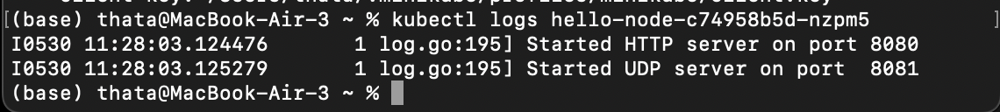

# Advanced Programming Module 11 - Deployment
### Athazahra Nabila Ruby - 2306173113

## Hello Minikube
> Compare the application logs before and after you exposed it as a Service. Try to open the app several times while the proxy into the Service is running. What do you see in the logs? Does the number of logs increase each time you open the app?
 

Before exposing the deployment using kubectl expose, the application logs only showed the initial messages, indicating that the container was running and listening but had not received any traffic.


After exposing it and accessing the URL, 2 new lines appeared. These log entries show that the service received HTTP GET requests, meaning the application was accessed from a browser or HTTP client.


I tried opening the service multiple times, and with each refresh, more GET / logs appeared, confirming that the pod was receiving and handling requests successfully.

> Notice that there are two versions of kubectl get invocation during this tutorial section. The first does not have any option, while the latter has -n option with value set to kube-system. What is the purpose of the -n option and why did the output not list the pods/services that you explicitly created?
 
- kubectl get pods,services shows the pods and services in the default namespace.
- kubectl get pods,services -n kube-system lists resources in the kube-system namespace, such as DNS and Metrics Server.
 
The -n flag is used to specify the namespace. Without it, kubectl shows resources only in the current or default namespace.


## Hello Minikube
>  What is the difference between Rolling Update and Recreate deployment strategy?
 
- Rolling Update = updates pods gradually, ensuring that some pods of the old version are still available while the new ones start running. This minimizes downtime and keeps the service accessible during updates.
- Recreate = terminates all existing pods first, then starts new ones. This may cause temporary downtime but it's simpler and may be used when old and new versions can’t run side by side.

> Try deploying the Spring Petclinic REST using Recreate deployment strategy and document your attempt.
 
I modified the deployment YAML by changing the strategy type to:
```
yaml
Copy
Edit
strategy:
  type: Recreate
```

After applying the updated manifest with kubectl apply -f deployment.yaml, I observed in kubectl get pods that all previous pods were terminated before the new ones started, showing the behavior of the Recreate strategy.

> Prepare different manifest files for executing Recreate deployment strategy.
 
Available on the repository as 'deployment-recreate.yaml'

> What do you think are the benefits of using Kubernetes manifest files?
 
Kubernetes manifest files make deployments more consistent, reproducible, and easier to manage. Instead of manually typing commands, I can apply changes reliably using kubectl apply -f, which reduces the chance of errors. They're also easier to track with version control and integrate into automation tools, making the deployment process smoother and more efficient.